<figure>
  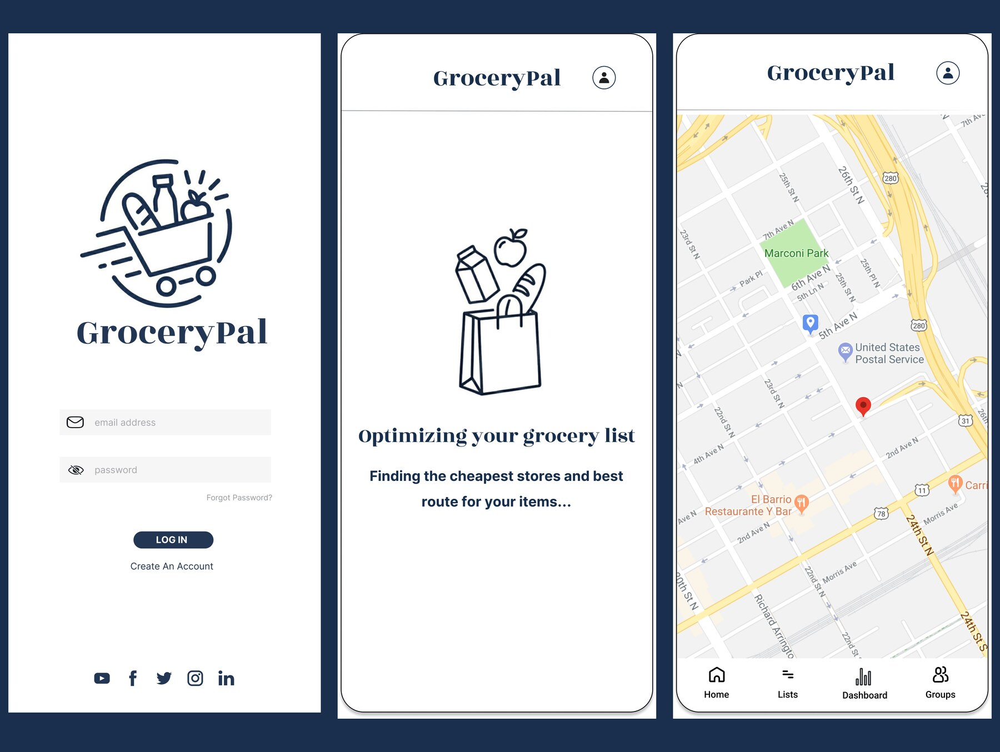
  <figcaption><em>GroceryPal — Home, Optimized Grocery List, and Dashboard. Final hi-fi mockup, May 2026.</em></figcaption>
</figure>

## Background

**GroceryPal** is a mobile app concept that helps budget-constrained college students plan efficient grocery trips without increasing cognitive effort or time. It was the team final project for **LIS 470: Information Architecture & Interaction Design** at UW–Madison, Spring 2026. Over the course of the semester my team and I cycled through every stage of the design-thinking process — empathize, define, ideate, prototype, test — across nine sequential studio assignments (A1–A9), each one feeding directly into the next. This case study walks through that arc from my perspective.

> **Disclaimer.** This was a group project. The contextual inquiry, affinity-diagramming, brainstorming, sketching, prototyping, and final mockup work described below were done collaboratively with my teammates **Angelique Carrillo**, **Helena Huang**, **Peixin Yang**, and **Yanbin Chen**. I'm telling the story from my own vantage point; their case studies are theirs to tell. Where decisions were made as a team, I've credited the team; where I owned a piece of work, I've called it out specifically.

### My role

I contributed across the full design cycle, but the pieces I owned end-to-end were:

- The **A6 sketch package**: three concept sketches (a meal planner, an auto-grocery-list generator, and a smart budget-and-substitution tool) and the integrated final sketch that combined the strongest elements of all three. The integrated sketch became the structural reference for the team's paper prototype.
- The **A7 storyboard**, which sequenced a budget-conscious student's weekly grocery flow — pantry check, list build, optimized routing, in-store shopping — into a single visual narrative.
- The **A9 individual reflection** on dark patterns and unintended consequences, which informed the team's stance on "ethical friction" in the final design (preserve budget visibility, don't make cost-shifting trivially easy).
- A **late-stage Figma audit and action plan** when our prototype was structurally ready but visually unfinished and not yet wired up — I documented every frame, identified the critical fixes, and wrote the phased delegation plan that got the team to a graded mockup before submission.
- The **final presentation deck** structure, script, and speaker-note distribution, plus stitching the recorded video together for the Canvas submission.

### The design process at a glance

We followed the five-stage **Design Thinking** model the course is built around. Each stage corresponded to one or two graded studio assignments, so the cadence forced reflection between phases rather than letting us race to a solution:

| Phase | Studio | What we produced |
|---|---|---|
| Empathize | A1–A3 | Fieldnotes from contextual inquiry sessions |
| Define | A4 | Affinity diagram → six themes → POV statement |
| Ideate | A5–A6 | "How Might We" board, four themes, three concepts → one integrated sketch |
| Prototype | A7–A8 | Storyboards, paper prototype + usability test, mid-fi wireframes |
| Test / Polish | Final | Hi-fi Figma mockup with eight connected screens |

---

## Empathize: Field Research with UW–Madison Students

<figure>
  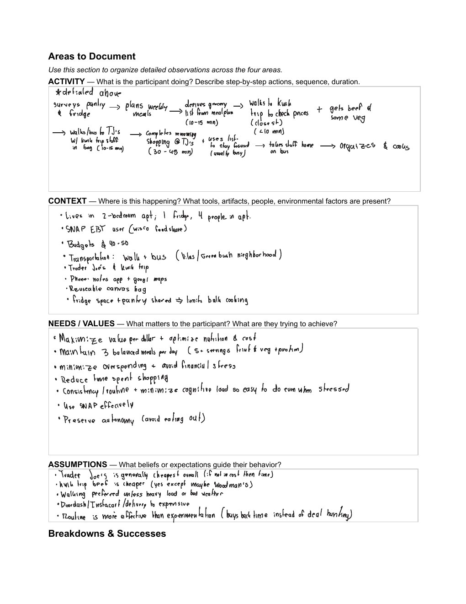
  <figcaption><em>One page of our merged A3 fieldnotes — observations captured while shadowing students through their actual weekly grocery routines.</em></figcaption>
</figure>

The project began with three weeks of **contextual inquiry**. The five of us shadowed UW–Madison students through their real grocery routines — at Kwik Trip, Trader Joe's, and Capital Centre Market in person, and on the Target app online. We sat with participants while they checked their pantries, built lists on their phones, and made stop-by-stop decisions in the aisles. We wrote dense fieldnotes during and immediately after each session, which became the raw material for everything that followed.

**What surprised me most about the users** was how layered the activity actually is. Going in, I assumed grocery shopping for students was basically a pricing problem — find the cheap option, buy it, leave. What I observed was the opposite. Students aren't running a single optimization; they're juggling at least four simultaneously — budgeting, transit planning, roommate communication, and decision fatigue inside the store. One participant deliberately routed herself between two stores on foot specifically because the inconvenience kept her from impulse buying. That's not a pricing problem. That's a *cognitive-load management* problem dressed up as a pricing problem.

That single reframing — from "students need cheaper groceries" to "students are already managing more grocery cognition than is sustainable" — became the lens we evaluated every later design decision through.

---

## Define: From Six Themes to a Single POV

<figure>
  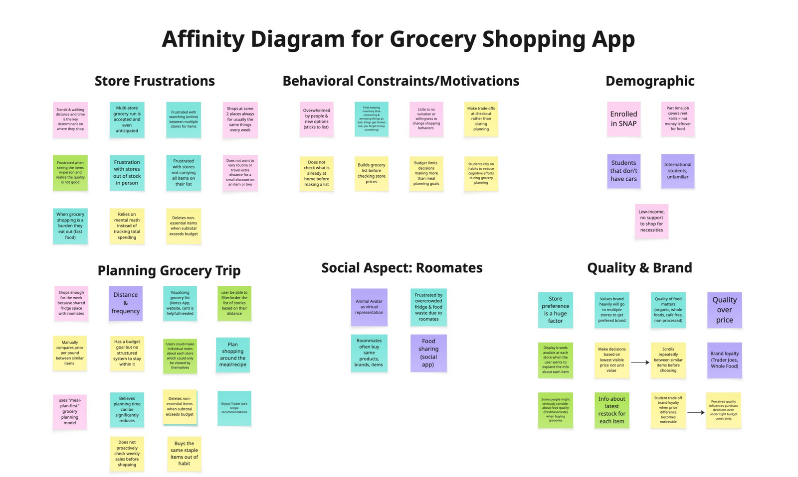
  <figcaption><em>Our A4 affinity diagram. Each sticky note is one observation from the fieldnotes; clusters became the six themes that defined the problem space.</em></figcaption>
</figure>

After the fieldnotes were collected, we transferred every observation onto sticky notes and built an **affinity diagram** together. Six themes surfaced from the clustering: *Store Frustrations*, *Behavioral Routines*, *Demographic Constraints* (SNAP, transit), *Planning Behaviors*, *Roommates / Social Context*, and *Quality and Brand Preferences*.

We didn't try to design for all six. We picked the three that mattered most for the kind of product we could realistically scope:

- **Behavioral Routines.** Students don't actually deal-hunt — they build routines. They pick the same stores, brands, and days, because routine reduces cognitive load even more than chasing the cheapest price does.
- **Coordination Overhead.** Roommates create hidden friction — duplicate purchases and food waste happen when communication breaks down. The breakdown is communication, not effort.
- **Multi-store Routing.** Students are already routing themselves between stores for the cheapest split. We didn't need to *teach* this behavior; we needed to *absorb* it.

From this synthesis we wrote the team's point-of-view statement:

> **Budget-constrained students need simple ways to plan efficient grocery trips without increasing cognitive effort or time.**

The tension in that sentence is what made it useful. Students want thoughtful, cost-conscious decisions, but the process of getting there is exhausting. So our problem wasn't "help students save money." It was "help students save money *without asking them to think harder*." Every later design choice — from how we showed prices to how we labeled the bottom navigation — got tested against that lens: *does it reduce mental effort, or does it just hide the effort somewhere new?*

**What I learned about the design process here** was how much work the affinity diagram does compared to its low-fi appearance. It looks like a wall of sticky notes, but the act of clustering forces you to articulate *why* observations belong together, and that articulation is where the themes actually emerge. I'd thought of affinity diagrams as documentation; they're really synthesis machines.

---

## Ideate: From Many Ideas to One Integrated Product

<figure>
  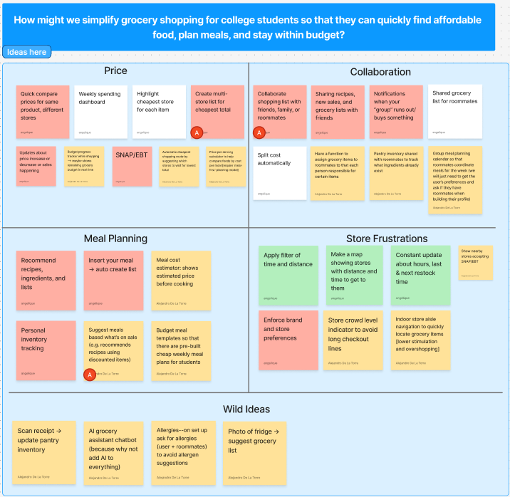
  <figcaption><em>The A5 brainstorming board, post-clustering and post-dot-vote. Four themes emerged: Price, Collaboration, Meal Planning, and Store Frustrations.</em></figcaption>
</figure>

With the problem framed, we ran a divergent brainstorming session anchored on a How-Might-We prompt: *how might we simplify grocery shopping for college students so they can quickly find affordable food, plan meals, and stay within budget?* We generated dozens of ideas individually, grouped them into four themes (**Price**, **Collaboration**, **Meal Planning**, **Store Frustrations**), and dot-voted to converge on three concepts worth developing further: a **smart price-comparison tool**, **collaborative grocery lists for roommates**, and a **budget-friendly meal-planning assistant**.

Each of us took one concept into A6 and produced three sketches plus a refined "final" sketch with peer feedback baked in. The pivotal moment came in critique: **we kept telling each other to combine features rather than pick one**. The price tool needed roommate sharing. The meal planner needed pantry awareness. The collaboration tool needed budget tracking. The three concepts weren't competing — they were three angles on the same underlying problem.

<figure>
  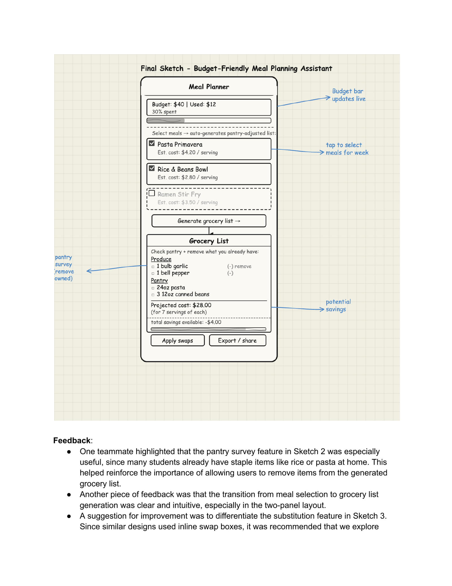
  <figcaption><em>My A6 final sketch — the Budget-Friendly Meal Planning Assistant with pantry-adjusted grocery list and live budget bar. Drawn after critique combined the strongest elements of my three earlier sketches.</em></figcaption>
</figure>

We made a deliberate choice to **build the integrated version** rather than picking one concept. From the brainstorming and sketching phase, the lesson I took with me was that "narrowing" doesn't always mean dropping ideas — sometimes it means recognizing that the ideas were never really separate to begin with.

---

## Prototype: Sketch → Storyboard → Paper Prototype → Wireframes → Hi-Fi

The integrated design moved through four prototype stages, each one informed by what the last one taught us.

### Storyboard

<figure>
  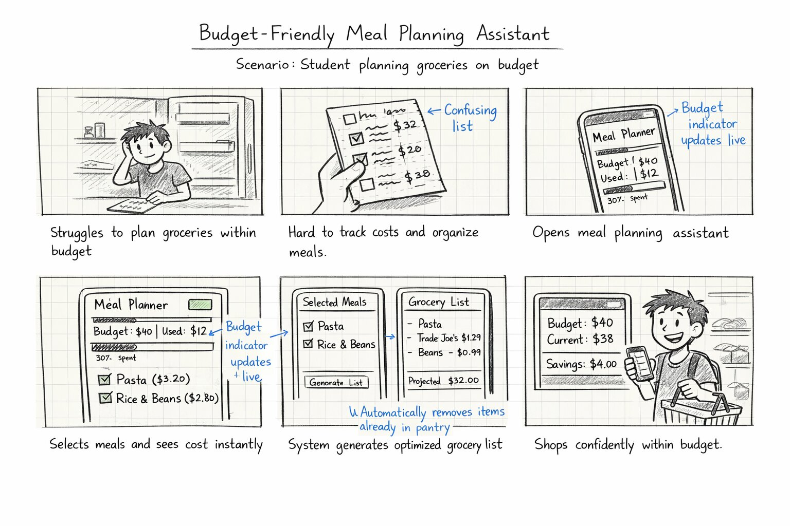
  <figcaption><em>My A7 storyboard — a six-frame narrative validating the user journey from pantry check through optimized routing to checkout.</em></figcaption>
</figure>

The storyboard's job was to validate that the user journey *as a whole* held up. Each of us drew one for A7 — mine traced a budget-conscious student's full weekly flow, and Helena's traced a roommate-coordination flow, so we covered both axes the integrated app needed to support.

### Paper Prototype + Usability Test

For the paper prototype we focused on the meal-planning core (the easiest piece to test on paper) and ran a single usability test with one college student. The takeaway: the meal-selection flow was intuitive, but the **generate-list step caused hesitation** — the user wasn't sure what would happen when they tapped it. That single observation drove a wireframe-level fix: the next iteration made list generation an explicit, labeled action with a confirmation state.

### Wireframes

<figure>
  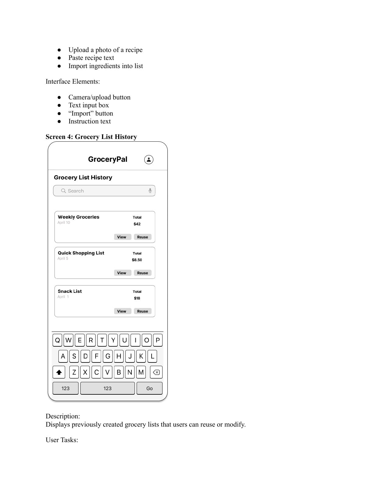
  <figcaption><em>One of the A8 wireframes — the Optimized Grocery List view, showing items split between two stores with running totals and savings.</em></figcaption>
</figure>

Wireframes (A8) were where the product's information architecture got locked in. We chose a **four-item bottom navigation** — Home, Lists, Dashboard, Groups — and committed to keeping that nav grid identical on every screen. This was a direct application of the IA principles from the course: consistent labels, predictable hierarchy, the same orientation cues everywhere so users don't have to re-learn the interface as they move between flows. *Reducing cognitive load wasn't a content decision — it was a structural one.*

### Hi-Fi Mockup

The final hi-fi mockup in Figma has eight connected screens and is built around a single demo task:

> **Demo task:** *Import a recipe and complete an optimized two-store trip while staying inside your monthly budget.*

The strongest screen in the file is the Optimized Grocery List — it's where four of the six insights from our affinity diagram converge into a single view:

<figure>
  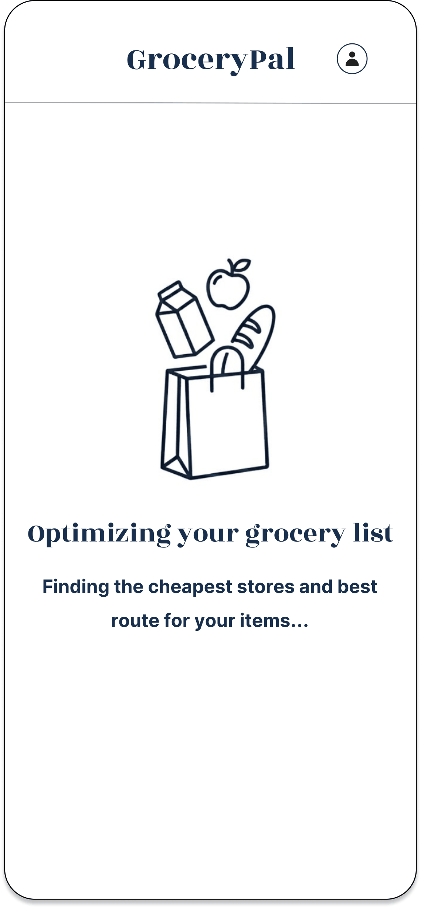
  <figcaption><em>Optimized Grocery List — items auto-grouped by cheapest store, with the savings call-out anchored at the bottom.</em></figcaption>
</figure>

Every visual decision on this screen traces back to either an observation insight or an information-architecture principle from class. **Visual hierarchy** pulls the eye to the savings call-out, which is the financial outcome students care most about. **Contrast** separates the two store cards so the split is legible at a glance. **Consistency** in the list pattern (item, price, action) means users don't have to re-parse each row. The choice to put store names as headers (rather than a per-item store column) reflects the routine-not-deal-hunting insight from A4: students don't compare stores item-by-item, they decide on stores and stick to them.

Here's the rest of the mockup at a glance:

  <figure style="margin:0;">
    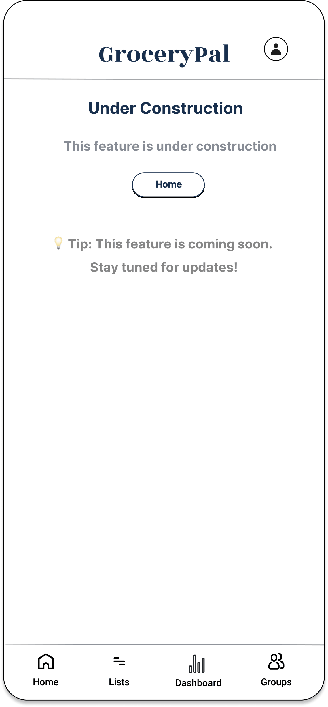
    <figcaption><em>Login</em></figcaption>
  </figure>
  <figure style="margin:0;">
    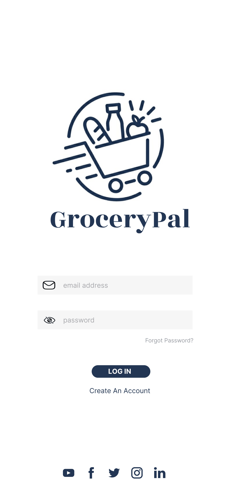
    <figcaption><em>Home / List Builder</em></figcaption>
  </figure>
  <figure style="margin:0;">
    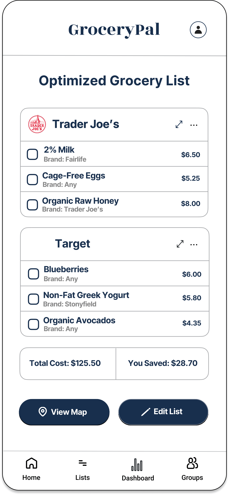
    <figcaption><em>Map — multi-stop route across the cheapest store split</em></figcaption>
  </figure>
  <figure style="margin:0;">
    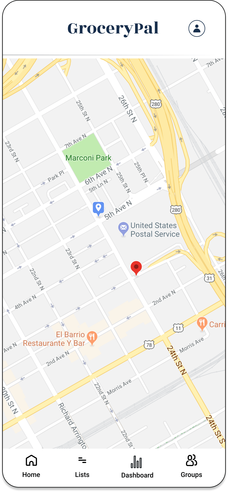
    <figcaption><em>Dashboard — full grocery total visible against monthly budget</em></figcaption>
  </figure>
  <figure style="margin:0;">
    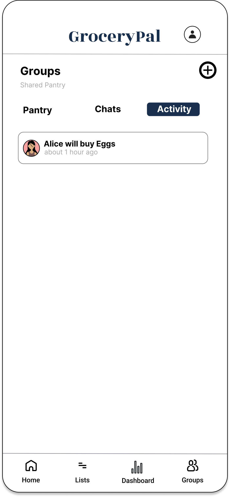
    <figcaption><em>Groups — shared pantry with roommate claims to prevent double-buys</em></figcaption>
  </figure>

### How the design solves the problem

The POV statement asked for a way to plan efficient grocery trips without increasing cognitive effort. GroceryPal solves it directly: the app **absorbs** the comparison, routing, coordination, and budgeting work students were already doing in their heads, so they get the financial benefit *without* the cognitive cost. The Dashboard keeps the full grocery total visible against the monthly budget at every step, so cost stays salient and never gets fragmented behind a "convenience" abstraction. The Groups tab eliminates the communication breakdown that A4 surfaced as the actual cause of duplicate buys and food waste. The Map turns the multi-store routing students were doing in their heads into a one-tap output of the optimized list.

---

## Try the Prototype

The interactive Figma prototype is published and clickable. The demo task is to **import a recipe and complete an optimized two-store trip while staying inside your monthly budget**.

---

## Reflections

### What I learned about the users

Going in, I thought the design problem was about price. By the end of A4 I understood it was about cognitive load — students were already doing more grocery cognition than was sustainable, and the friction wasn't the cost, it was the *thinking about cost* layered on top of every other constraint they were managing. That shift, from "give them the cheap option" to "absorb the work they're already doing," reframed every later decision and is the single most useful thing field research taught me. **You can't design for users you've assumed; you can only design for users you've watched.**

### What I learned about the design process

The structure of the course — discrete, sequential studio assignments rather than a free-form project — was something I underestimated at the start. By the end I appreciated it. Each assignment forced reflection between phases, which meant we couldn't skip from "I have an idea" to "let's build it" without first having to defend why the idea was the right one given the prior assignment's findings. The affinity diagram in particular surprised me: it looks low-fi but it does a huge amount of synthesis work, and the discipline of clustering observations is what produces the themes — themes don't pre-exist somewhere waiting to be found.

The hardest stretch was A6→A7→A8. We had a lot of feature ideas from brainstorming and a fairly clear POV, but converting that into a *coherent integrated app* — rather than a list of features bolted onto a shell — took more iteration than I expected. The peer-critique step in A6 was where it actually clicked: hearing teammates point out overlap between sketches forced us to recognize that the three concepts were three angles on one product.

### What I learned about myself as a designer

Two things. First, I default to **structural thinking** — when I sketched, my instinct was to lay out the navigation grid before I drew any individual screen, which made the IA work later much easier but probably under-served the visual-design side. The audit-and-action-plan I wrote near the end of the project was the most natural piece of work in the cycle for me: looking at a Figma file, identifying what was structurally complete versus what was visually unfinished, and writing a phased plan to close the gap. That's the kind of design work I'm good at.

Second, I learned where I have growth ahead of me — specifically in **visual fluency**. The Figma file lived in a state of structural completeness for a while before it looked finished, because the team (myself included) was more comfortable making the IA right than making the surface design polished. The course concepts on visual hierarchy, contrast, and accent color usage were the ones I had to most actively translate from "I know what those mean" to "I can see when this screen is missing them." Next iteration I'd budget that work explicitly into the schedule rather than letting it become the late-stage rush it was.

---

## Acknowledgments

To my teammates **Angelique Carrillo**, **Helena Huang**, **Peixin Yang**, and **Yanbin Chen** — the work above is shared work, and each of them owned pieces of it as substantively as I did. To the **LIS 470 teaching team** for a curriculum that built every assignment on the previous one. And to the participants who let us shadow them through grocery runs that they probably didn't think of as research material — the entire project rests on what we learned by watching them.
